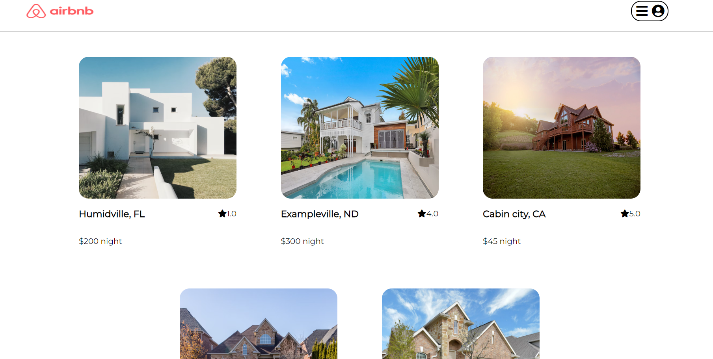

This is the Readme for my Clonebnb

Clonebnb is a web application project inspired by Airbnb. Clonebnb seeks to be an online marketplace for advertising or renting short-term rentals.

Please see below links to project Wiki:
[Feature List](https://github.com/kmtsou/AirBnBClone/wiki/Features-List)
[Database Schema](https://github.com/kmtsou/AirBnBClone/wiki/Database-Schema-Image-with-Relationships)
[API Routes](https://github.com/kmtsou/AirBnBClone/wiki/Api-Routes)
[Redux Store State Shape](https://github.com/kmtsou/AirBnBClone/wiki/Redux-State-Shape)

This project was built with:
JavaScript
Express
Sequelize
React
Redux

Splash page image:

In order to run locally, clone the repo and run npm install in both the frontend and backend folders. Then create a .env file in the backend folder that has a PORT, DB_FILE, JWT_SECRET, JWT_EXPIRES_IN variables. Then add a proxy to your frontend package json.
